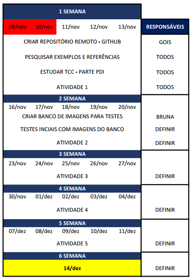

# MAR

O projeto MAR (Metal Artefact Reduction) se encaixa na área de processamento digitais de imagens e basea-se na redução ruídos causado pela presença de artefatos de metal em tomografias através de interpolação e filtragem de sinograma.

### Cronograma Inicial

### Atividades

#### Atividade 1 

- Pesquisar algoritmos para correção de erros em imagens de tomografia que possui artefatos metálicos.
- Elaborar ou descrever possível técnica que pode ser utilizada para realçar a imagem, dentro do conteúdo da disciplina.

#### Atividade 2

- Quais técnicas de interpolação, realce e filtragem são viáveis para aplicar no problema apresentado.
- Gerar e entender sinograma da imagem;

#### Atividade 3

- Realçar brilho;
- Interpolar imagem;
- Testes com imagens reais;
- Documentação;

#### Atividade 4

- Finalizar atividades passadas;
- Filtrar para melhorar imagem;
- Documentação;

#### Atividade 5

- Finalizar atividades pendentes;
- Documentação ou desenvolvimento de código;
- Elaborar apresentação;

